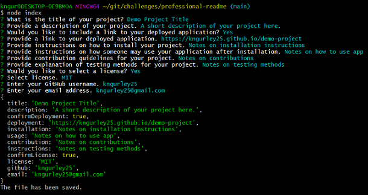
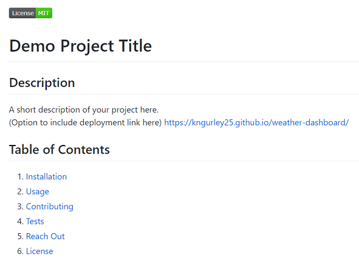

# professional-readme

## Description
An application in which a user can generate a professional README file by providing information into a command line interface given specific prompts.

## Installation
To install this application:
1. Clone repository
1. Download npm dependencies with 'npm install' command

## Usage
To use this application:
1. Invoke application start with 'node index.js' command
1. Answer command line prompts
1. View the generated README markdown file in the distribution directory (./dist)

View this walk-through on how to use the professional-readme application:  
[Demo Video](https://watch.screencastify.com/v/oI1F4ET2Ai1VPf89MNb7)

## Technologies
- JavaScript
- node.js
- node package manager (npm)

## Demo Images
*Command line prompts*

*Preview of generated markdown file*

## Questions
Reach out to me on GitHub or contact me by email address.  
- [GitHub Profile](https://github.com/kngurley25)  
- kngurley25@gmail.com
